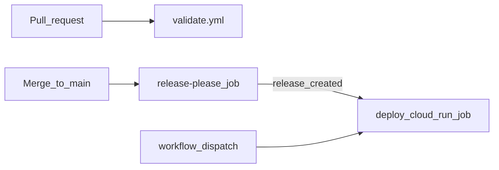

# dbt-rabbit-samples

Sample [dbt](https://www.getdbt.com/) project that mirrors the BigQuery ELT pipelines in [rabbit-sample-dags](https://github.com/followrabbit-ai/rabbit-sample-dags) using dbt models instead of Airflow DAGs.

Two independent pipelines run against BigQuery public datasets:

| Pipeline | Source | Staging | Mart |
| --- | --- | --- | --- |
| **Bikeshare** | `bigquery-public-data.austin_bikeshare.bikeshare_trips` | `stg_bikeshare_trips` | `mart_daily_rides` |
| **Bitcoin Cash** | `bigquery-public-data.crypto_bitcoin_cash.transactions` | `stg_bch_transactions` | `mart_daily_bch_transactions` |

Each pipeline loads a rolling 30-day window into staging, then aggregates to a daily mart. The Airflow demos also export marts to GCS as Parquet — that step is out of scope for this repo; the focus is dbt modeling and Rabbit Pricing Model Optimization.

## Prerequisites

1. **[uv](https://docs.astral.sh/uv/getting-started/installation/)** — Python package and environment manager
2. **Python 3.10+** (uv will install one if needed)
3. **Google Cloud project** with BigQuery enabled
4. **Authentication** — for local dev with `method: oauth` in the profile, set up Application Default Credentials:
   ```bash
   gcloud auth application-default login
   ```
5. **BigQuery IAM** on your project:
   - `roles/bigquery.jobUser` (project level)
   - `roles/bigquery.dataEditor` on the target dataset
6. **Public data access** — `roles/bigquery.dataViewer` on `bigquery-public-data` is granted by default.

Create the base dataset (dbt creates `dbt_demo_staging` and `dbt_demo_marts` automatically on first run):

```bash
export GCP_PROJECT=your-project-id
bq --location=US mk --dataset "${GCP_PROJECT}:dbt_demo"
```

## Setup

### 1. Virtual environment

```bash
uv venv dbt-rabbit
source dbt-rabbit/bin/activate
uv pip install -r requirements.txt
```

### 2. Profile

Copy the sample profile and set your project:

```bash
mkdir -p ~/.dbt
cp profiles.sample.yml ~/.dbt/profiles.yml
```

Or point dbt at the repo for local testing:

```bash
export DBT_PROFILES_DIR="$(pwd)"
cp profiles.sample.yml profiles.yml
```

Set environment variables:

```bash
export GCP_PROJECT=your-project-id
export GCP_DATASET=dbt_demo      # optional, this is the default
export GCP_LOCATION=US           # optional, this is the default
```

### 3. Verify connection

```bash
dbt debug
```

## Running the project

`dbt build` runs models and tests in dependency order — schema and unit tests execute after each model builds.

Run both pipelines:

```bash
dbt build
```

Run a single pipeline:

```bash
dbt build --select bikeshare
dbt build --select bitcoin_cash
```

## Development

Install linting dependencies (in addition to the main requirements):

```bash
uv pip install -r requirements-dev.txt
```

Validate the project locally:

```bash
export GCP_PROJECT=your-project-id   # required for dbt parse/build profile resolution
dbt parse
sqlfluff lint models/                # dbt templater; requires ADC for BigQuery adapter init
dbt build                            # runs models + schema/unit tests (requires BigQuery)
```

CI linting uses a credential-free path: `dbt parse` then SQLFluff on source models via [`.sqlfluff.ci`](.sqlfluff.ci) (`templater = jinja` with `apply_dbt_builtins` and project macros). The dbt templater requires a BigQuery connection on GitHub Actions; `dbt compile` does too in dbt 1.11.

Unit tests mock upstream `source()` / `ref()` inputs so transform logic is verified without scanning public datasets.

## CI/CD

Pull requests run lint/parse checks. Merges to `main` go through [release-please](https://github.com/googleapis/release-please); a new GitHub Release triggers deployment to a **Cloud Run Job** that runs `dbt build --target prod --exclude resource_type:unit_test` (models + schema tests; unit tests run locally only).



| Step | What happens |
| --- | --- |
| **Pull request** | [`validate.yml`](.github/workflows/validate.yml) runs `dbt parse` + SQLFluff on source models (no GCP credentials) |
| **Merge to main** | release-please opens/updates a release PR (version + changelog) |
| **Release merged** | Tag created → [`release.yml`](.github/workflows/release.yml) builds image and updates Cloud Run Job |
| **Manual** | `workflow_dispatch` on Release workflow redeploys without a new version |

### How releases work

1. Every push to `main` runs release-please, which opens or updates a Release PR from [Conventional Commits](https://www.conventionalcommits.org/) (`feat:` → minor, `fix:` → patch, breaking change → major).
2. Merging the Release PR creates a GitHub Release + tag and triggers the deploy job.
3. The deploy job ensures the Cloud Run Job's runtime service account exists (creating it and granting BigQuery access on first run if needed), builds a container image, pushes it to the shared `followrabbit-ai-public/images` Artifact Registry repo (Terraform-managed, not per-project), and updates the Cloud Run Job. The image entrypoint is `dbt build --target prod --exclude resource_type:unit_test` so prod runs models and schema tests but not unit tests. **No schedule** — run the job manually when you want a build:

```bash
gcloud run jobs execute dbt-rabbit-samples \
  --region=us-central1 \
  --project=YOUR_GCP_PROJECT_ID
```

### Required GitHub Variables

Settings → Secrets and variables → Actions → Variables (and a `production` environment if you want an approval gate):

| Name | Purpose | Example |
| --- | --- | --- |
| `GCP_PROJECT_ID` | Target GCP project (Cloud Run Job + BigQuery) | `rbt-sandbox-stewart` |
| `GCP_WIF_PROVIDER` | Workload Identity Federation provider | `projects/…/providers/…` |
| `GCP_DEPLOY_SA` | Deploy service account (build/push/update job), provisioned by the foundation team's Terraform, not this repo | `dbt-rabbit-samples-pub@followrabbit-ai-public.iam.gserviceaccount.com` |
| `GCP_RUNTIME_SA` | Service account the Cloud Run Job runs as (BigQuery access) — created automatically by the deploy job on first run if missing | `dbt-rabbit-samples-runtime@….iam.gserviceaccount.com` |
| `GCP_REGION` | Cloud Run region (optional) | `us-central1` |
| `GCP_REGISTRY_PROJECT_ID` | Project hosting the shared `images` Artifact Registry repo (optional) | `followrabbit-ai-public` |
| `GCP_DATASET` | BigQuery dataset base name (optional) | `dbt_demo` |
| `GCP_LOCATION` | BigQuery location (optional) | `US` |
| `CLOUD_RUN_JOB_NAME` | Cloud Run Job name (optional) | `dbt-rabbit-samples` |

PR validation does **not** need these variables. Deploy runs only after a release (or manual workflow dispatch).

Images are pushed to the shared, Terraform-managed `us-docker.pkg.dev/${GCP_REGISTRY_PROJECT_ID}/images/dbt-rabbit-samples` registry — not a per-project repo, and the deploy SA has no rights to create Artifact Registry repos (by design; see `dbt-rabbit-samples-pub` in the foundation repo). The deploy SA holds `roles/artifactregistry.writer` (scoped to that shared repo's `us` mirror), `roles/run.developer`, and `roles/iam.serviceAccountAdmin` + `roles/resourcemanager.projectIamAdmin` on `GCP_PROJECT_ID` — the latter two so the deploy job can create/manage the runtime SA itself, which is what the "Ensure runtime SA exists" step does. The runtime SA is granted `roles/bigquery.jobUser` and `roles/bigquery.dataEditor` at the project level.

WIF pool/provider setup is provisioned outside this repo (same pattern as [rabbit-sample-dags](https://github.com/followrabbit-ai/rabbit-sample-dags)).

## Project layout

```
models/
├── bikeshare/
│   ├── staging/stg_bikeshare_trips.sql
│   └── marts/mart_daily_rides.sql
└── bitcoin_cash/
    ├── staging/stg_bch_transactions.sql
    └── marts/mart_daily_bch_transactions.sql
```

Models land in BigQuery under schema suffixes:

- `{project}.dbt_demo_staging` — staging tables
- `{project}.dbt_demo_marts` — mart tables

## Roadmap

Phases 1–3 build a mature dbt repo (quality gates, deployment). Phase 4 demonstrates Rabbit Pricing Model Optimization as a minimal add-on to an existing project.

1. **Phase 1 (complete)** — Generic dbt project with standard `dbt-bigquery` adapter
2. **Phase 2 (complete)** — Tests and linting (local SQLFluff + expanded dbt schema and unit tests)
3. **Phase 3 (complete)** — CI/CD and deployment via **Cloud Run Job**
4. **Phase 4 (next)** — Rabbit Pricing Model Optimization via [`dbt-rabbit-bigquery`](https://github.com/followrabbit-ai/bq-job-optimizer-dbt)

## License

MIT — see [LICENSE](LICENSE).
