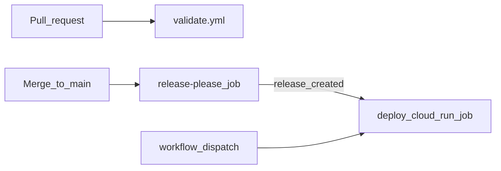

# dbt-rabbit-samples

Sample [dbt](https://www.getdbt.com/) project with BigQuery ELT pipelines, used to demonstrate Rabbit Pricing Model Optimization.

Two independent pipelines run against BigQuery public datasets:

| Pipeline | Source | Staging | Mart |
| --- | --- | --- | --- |
| **Bikeshare** | `bigquery-public-data.austin_bikeshare.bikeshare_trips` | `stg_bikeshare_trips` | `mart_daily_rides` |
| **Bitcoin Cash** | `bigquery-public-data.crypto_bitcoin_cash.transactions` | `stg_bch_transactions` | `mart_daily_bch_transactions` |

Each pipeline loads a rolling 30-day window into staging, then aggregates to a daily mart.

## Rabbit Pricing Model Optimization

Every target (`dev` and `prod`) uses [`dbt-rabbit-bigquery`](https://github.com/followrabbit-ai/bq-job-optimizer-dbt) (`type: rabbitbigquery` in `profiles.sample.yml` / `profiles.docker.yml`) — a drop-in replacement for `dbt-bigquery` that routes each query to whichever is cheaper, on-demand or slot-based/reservation pricing, with no SQL changes. It's a superset of the standard adapter: same `method: oauth` connection, same models, same tests, plus three extra profile keys (`rabbit_api_key`, `rabbit_default_pricing_mode`, and optionally `rabbit_reservation_ids`).

See [PR #16](https://github.com/followrabbit-ai/dbt-rabbit-samples/pull/16) for the full audit trail of this implementation — every file changed and why.

### Config Steps
1. Generate an API key at [app.followrabbit.ai/api-keys](https://app.followrabbit.ai/api-keys) for your tenant.
2. Local dev: `export RABBIT_API_KEY=...` alongside `GCP_PROJECT`/`GCP_DATASET`/`GCP_LOCATION` (see [Setup](#setup) below).
3. Prod (Cloud Run Job): store the key in Secret Manager (default secret name `rabbit-api-key` in `GCP_PROJECT_ID`) and grant `roles/secretmanager.secretAccessor` on it to the runtime SA. `release.yml` passes it into the container via `--set-secrets` — see [Required GitHub Variables](#required-github-variables).

### Config
`rabbit_default_pricing_mode` and `rabbit_reservation_ids` are set via `RABBIT_DEFAULT_PRICING_MODE` and `RABBIT_RESERVATION_IDS` env vars, same pattern as `GCP_DATASET`/`GCP_LOCATION` (see [Setup](#setup) below) — default to `on_demand` and unset. With `rabbit_reservation_ids` empty, the adapter treats it as a required field for optimization to actually engage: every job logs `RabbitBigQuery adapter: Rabbit optimization disabled: Missing required rabbit_reservation_ids` and dbt falls through to plain BigQuery behavior (verified via a full `dbt build`, 16/16 models/tests still pass, identical to the pre-Rabbit baseline). Set `RABBIT_RESERVATION_IDS` to your reservation ID(s) (format `project:location.reservation-name`, comma-separated for multiple) to enable routing. See the [adapter's README](https://github.com/followrabbit-ai/bq-job-optimizer-dbt) for the full config reference (multiple/regional reservations, `rabbit_enabled` toggle, statement-level routing).

### Verification
`dbt run --debug` and check `logs/dbt.log` for `RabbitBigQuery` lines, or view optimized jobs in the [Rabbit dashboard](https://app.followrabbit.ai/gcp/optimization/bigquery/automation?bq-automation-tab=DYNAMIC_PRICING).

## Project layout

```
models/
├── bikeshare/
│   ├── staging/stg_bikeshare_trips.sql
│   └── marts/mart_daily_rides.sql
└── bitcoin_cash/
    ├── staging/stg_bch_transactions.sql
    └── marts/mart_daily_bch_transactions.sql
```

Models land in BigQuery under schema suffixes:

- `{project}.dbt_demo_staging` — staging tables
- `{project}.dbt_demo_marts` — mart tables

## Prerequisites

1. **[uv](https://docs.astral.sh/uv/getting-started/installation/)** — Python package and environment manager
2. **Python 3.10+** (uv will install one if needed)
3. **Google Cloud project** with BigQuery enabled
4. **Authentication** — for local dev with `method: oauth` in the profile, set up Application Default Credentials:
   ```bash
   gcloud auth application-default login
   ```
5. **BigQuery IAM** on your project:
   - `roles/bigquery.jobUser` (project level)
   - `roles/bigquery.dataEditor` on the target dataset
6. **Public data access** — `roles/bigquery.dataViewer` on `bigquery-public-data` is granted by default.
7. **Rabbit API key** — required by every target now that the profile uses the `rabbitbigquery` adapter. Generate one at [app.followrabbit.ai/api-keys](https://app.followrabbit.ai/api-keys); see [Rabbit Pricing Model Optimization](#rabbit-pricing-model-optimization) above.

Create the base dataset (dbt creates `dbt_demo_staging` and `dbt_demo_marts` automatically on first run):

```bash
export GCP_PROJECT=your-project-id
bq --location=US mk --dataset "${GCP_PROJECT}:dbt_demo"
```

## Setup

### 1. Virtual environment

```bash
uv venv dbt-rabbit
source dbt-rabbit/bin/activate
uv pip install -r requirements.txt
```

### 2. Profile

Copy the sample profile and set your project:

```bash
mkdir -p ~/.dbt
cp profiles.sample.yml ~/.dbt/profiles.yml
```

Or point dbt at the repo for local testing:

```bash
export DBT_PROFILES_DIR="$(pwd)"
cp profiles.sample.yml profiles.yml
```

Set environment variables:

```bash
export GCP_PROJECT=your-project-id
export GCP_DATASET=dbt_demo      # optional, this is the default
export GCP_LOCATION=US           # optional, this is the default
export RABBIT_API_KEY=your-rabbit-api-key
```

### 3. Verify connection

```bash
dbt debug
```

## Running the project

`dbt build` runs models and tests in dependency order — schema and unit tests execute after each model builds.

Run both pipelines:

```bash
dbt build
```

Run a single pipeline:

```bash
dbt build --select bikeshare
dbt build --select bitcoin_cash
```

## Development

Install linting dependencies (in addition to the main requirements):

```bash
uv pip install -r requirements-dev.txt
```

Validate the project locally:

```bash
export GCP_PROJECT=your-project-id   # required for dbt parse/build profile resolution
dbt parse
sqlfluff lint models/                # dbt templater; requires ADC for BigQuery adapter init
dbt build                            # runs models + schema/unit tests (requires BigQuery)
```

CI linting uses a credential-free path: `dbt parse` then SQLFluff on source models via [`.sqlfluff.ci`](.sqlfluff.ci) (`templater = jinja` with `apply_dbt_builtins` and project macros). The dbt templater requires a BigQuery connection on GitHub Actions; `dbt compile` does too in dbt 1.11.

Unit tests mock upstream `source()` / `ref()` inputs so transform logic is verified without scanning public datasets.

## CI/CD Reference Architecture

This repository contains a reference architecture using GitHub Actions, Workload Identity Federation, and Cloud Run for deploying dbt workloads to the Google Cloud.
Of course, your CI/CD may look very different, but you can adapt the concepts here for productionizing Pricing Model Optimization.

Pull requests run lint and parse checks. Merges to `main` go through [release-please](https://github.com/googleapis/release-please); a new GitHub Release triggers deployment to a **Cloud Run Job**.



| Step | What happens |
| --- | --- |
| **Pull request** | [`validate.yml`](.github/workflows/validate.yml) runs `dbt parse` + SQLFluff on source models (no GCP credentials) |
| **Merge to main** | release-please opens/updates a release PR (version + changelog) |
| **Release merged** | Tag created → [`release.yml`](.github/workflows/release.yml) builds image and updates Cloud Run Job |
| **Manual** | `workflow_dispatch` on Release workflow redeploys without a new version |

### How releases work

1. Every push to `main` runs release-please, which opens or updates a Release PR from [Conventional Commits](https://www.conventionalcommits.org/) (`feat:` → minor, `fix:` → patch, breaking change → major).
2. Merging the Release PR creates a GitHub Release + tag and triggers the deploy job.
3. The deploy job ensures the Cloud Run Job's runtime service account exists (creating it and granting BigQuery access on first run if needed), builds a container image, pushes it to the shared `followrabbit-ai-public/images` Artifact Registry repo, and updates the Cloud Run Job — injecting the Rabbit API key from Secret Manager via `--set-secrets` (see [Rabbit Pricing Model Optimization](#rabbit-pricing-model-optimization)). The image entrypoint is `dbt build --target prod --exclude resource_type:unit_test` so prod runs models and schema tests but not unit tests. **No schedule** — run the job manually when you want a build:

```bash
gcloud run jobs execute dbt-rabbit-samples \
  --region=us-central1 \
  --project=YOUR_GCP_PROJECT_ID
```

### Required GitHub Variables

Settings → Secrets and variables → Actions → Variables (and a `production` environment if you want an approval gate):

| Name | Purpose | Example |
| --- | --- | --- |
| `GCP_PROJECT_ID` | Target GCP project (Cloud Run Job + BigQuery) | `rbt-sandbox-stewart` |
| `GCP_WIF_PROVIDER` | Workload Identity Federation provider | `projects/…/providers/…` |
| `GCP_DEPLOY_SA` | Deploy service account (build/push/update job), provisioned by the foundation team's Terraform, not this repo | `dbt-rabbit-samples-pub@followrabbit-ai-public.iam.gserviceaccount.com` |
| `GCP_RUNTIME_SA` | Service account the Cloud Run Job runs as (BigQuery access) — created automatically by the deploy job on first run if missing | `dbt-rabbit-samples-runtime@….iam.gserviceaccount.com` |
| `GCP_REGION` | Cloud Run region (optional) | `us-central1` |
| `GCP_REGISTRY_PROJECT_ID` | Project hosting the shared `images` Artifact Registry repo (optional) | `followrabbit-ai-public` |
| `GCP_DATASET` | BigQuery dataset base name (optional) | `dbt_demo` |
| `GCP_LOCATION` | BigQuery location (optional) | `US` |
| `CLOUD_RUN_JOB_NAME` | Cloud Run Job name (optional) | `dbt-rabbit-samples` |
| `RABBIT_SECRET_NAME` | Secret Manager secret name holding the Rabbit API key (optional) | `rabbit-api-key` |
| `RABBIT_DEFAULT_PRICING_MODE` | Default Rabbit pricing mode — `on_demand` or `slot_based` (optional) | `on_demand` |
| `RABBIT_RESERVATION_IDS` | BigQuery reservation ID(s) for Rabbit to route eligible jobs onto, comma-separated (optional) | `my-project:us.res1` |

PR validation does **not** need these variables. Deploy runs only after a release (or manual workflow dispatch).

WIF pool/provider setup is provisioned outside this repo.

## License

MIT — see [LICENSE](LICENSE).
